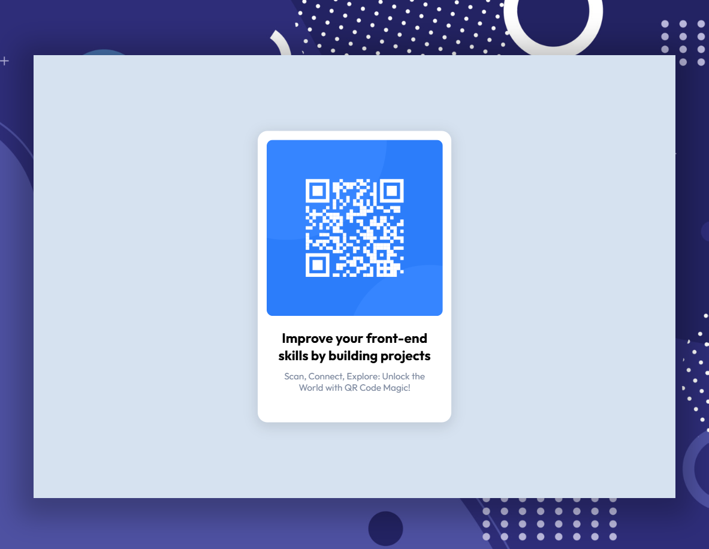
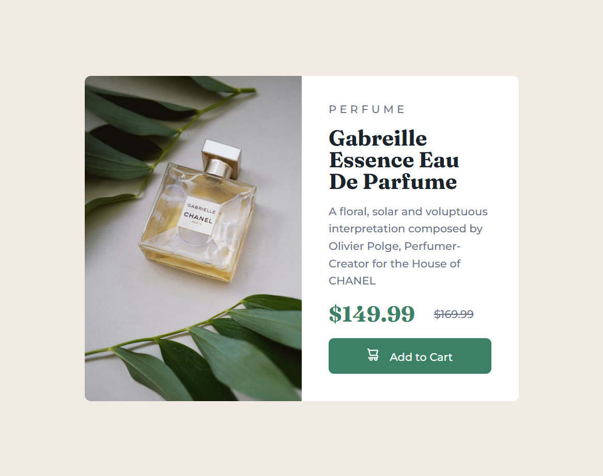
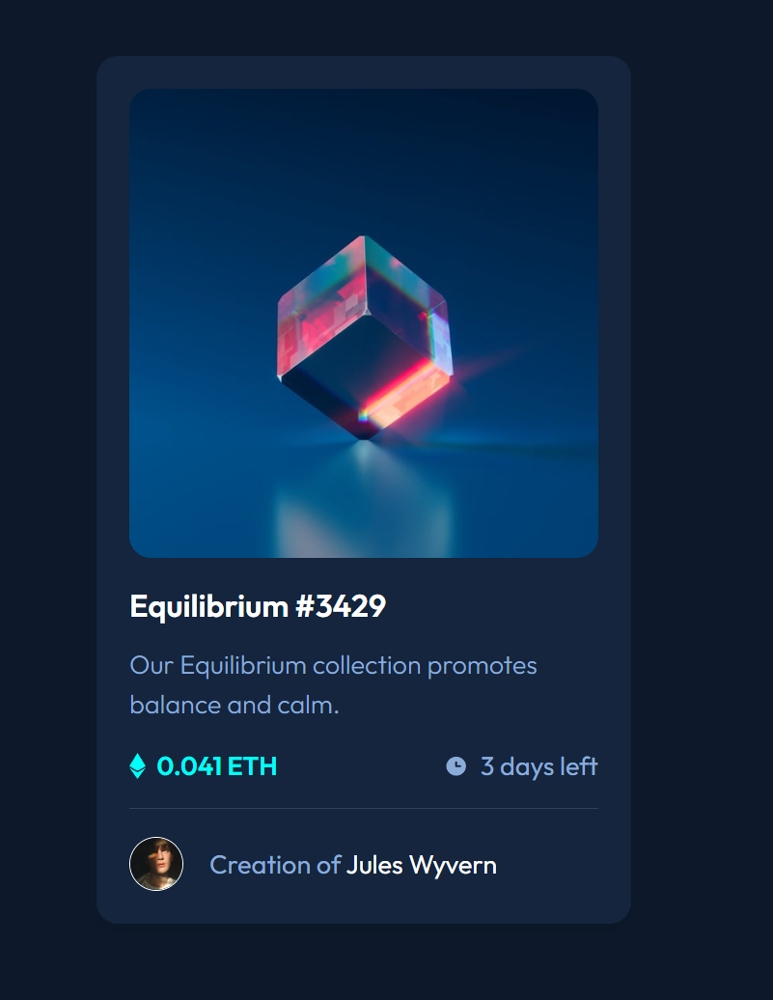
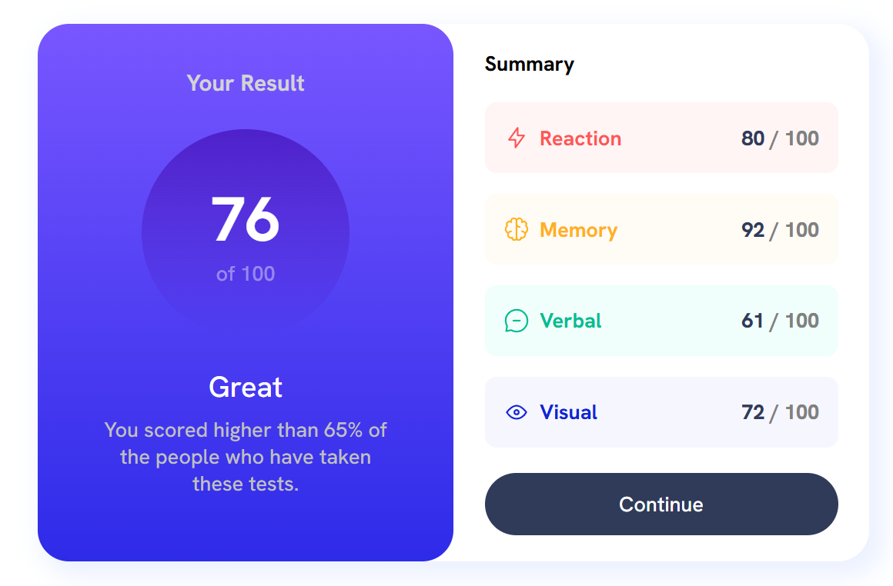
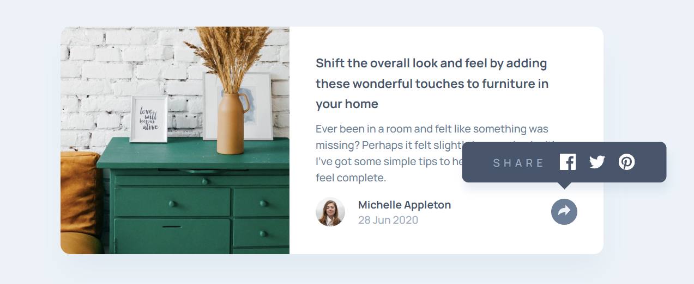
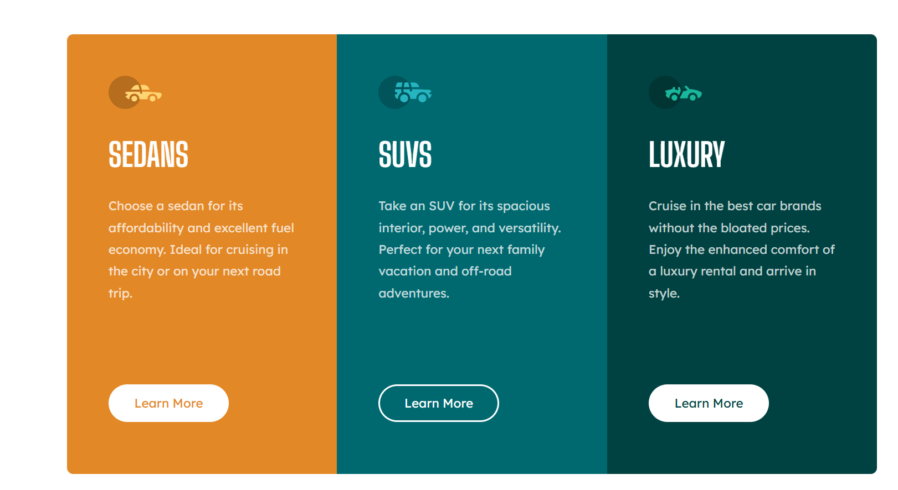
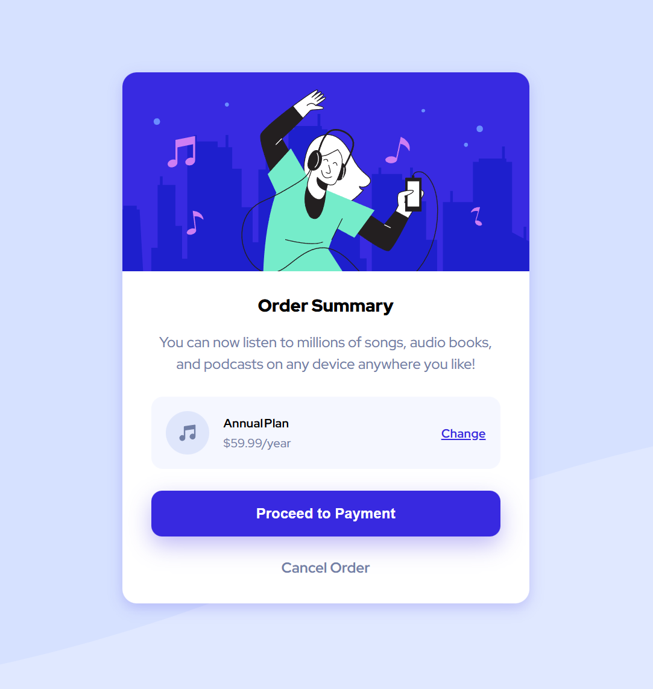
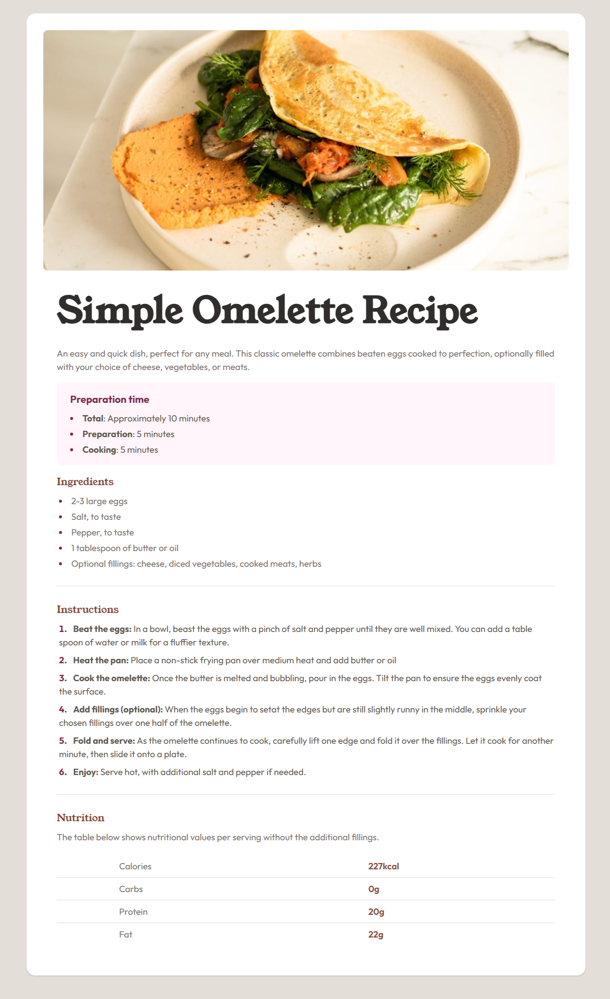

## Frontend Mentor Challenges:

| Live Demo                                                                                                   | Preview                                                  |
| ----------------------------------------------------------------------------------------------------------- | -------------------------------------------------------- |
| [QR code component](https://iarmankarimi.github.io/challenge-qr-code-component)                             |              |
| [Product preview card component](https://iarmankarimi.github.io/challenge-product-preview-card-component)   |      |
| [NFT preview card component](https://iarmankarimi.github.io/challenge-nft-preview-card-component)           |                  |
| [Results summary component](https://iarmankarimi.github.io/challenge-results-summary-component)             |      |
| [Article preview component](https://iarmankarimi.github.io/challenge-article-preview-component)             |      |
| [3 Column preview card component](https://iarmankarimi.github.io/challenge-3-column-preview-card-component) |  |
| [Order summary component](https://iarmankarimi.github.io/challenge-order-summary-component)                 |        |
| [Recipe page](https://iarmankarimi.github.io/challenge-recipe-page)                                         |               |
| [Profile card](https://iarmankarimi.github.io/challenge-profile-card-component)                             |           |

